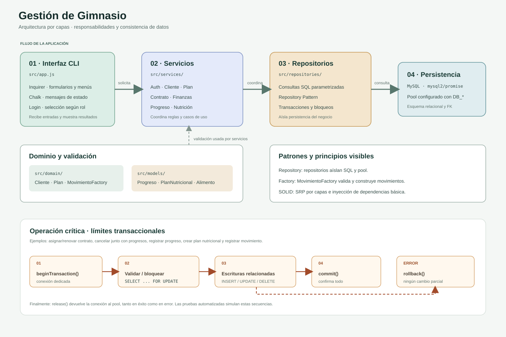

# Arquitectura

CLI (Inquirer/Chalk) → Services → Repositories → MySQL (`mysql2/promise`). La composición de dependencias se realiza en `src/app.js`.

- CLI solicita y presenta datos y controla las opciones por rol.
- Services coordinan validación de dominio y operaciones.
- Repositories encapsulan SQL parametrizado.
- `domain/` contiene entidades (`Cliente`, `Plan`) y la Factory de movimientos.
- `models/` contiene modelos validados de progreso y nutrición.
- `config/database.js` crea el pool MySQL desde variables `DB_*` del entorno.

## Patrones

- **Repository:** `ClienteRepository`, `PlanRepository`, `ContratoRepository`, `FinanzasRepository` y `UsuarioRepository` separan acceso SQL de servicios.
- **Factory:** `MovimientoFactory` valida los datos y crea el objeto que Finanzas persiste.

## SOLID

Se observa SRP en la división general por capas y una forma básica de Dependency Inversion mediante dependencias recibidas por constructor. No se afirma cobertura completa de SOLID: la CLI aún reúne composición, flujo de interacción y parte de la coordinación; no hay interfaces explícitas y faltan módulos funcionales para evaluar mejor otros principios.

## Consistencia transaccional

`ContratoRepository.crear` bloquea cliente/plan activos y registra la asignación en una transacción. `ContratoRepository.cancelar` bloquea la fila con `FOR UPDATE`, elimina progresos asociados, cambia el estado y confirma o revierte todo conjuntamente. `ContratoRepository.renovar` finaliza el contrato previo y crea el siguiente atómicamente. `ProgresoRepository.crear` bloquea y valida el contrato antes de insertar, impidiendo más de un registro por semana. `FinanzasRepository.registrar` abre una transacción, valida/bloquea el contrato opcional, inserta el movimiento y confirma; ante error hace rollback y libera la conexión.

