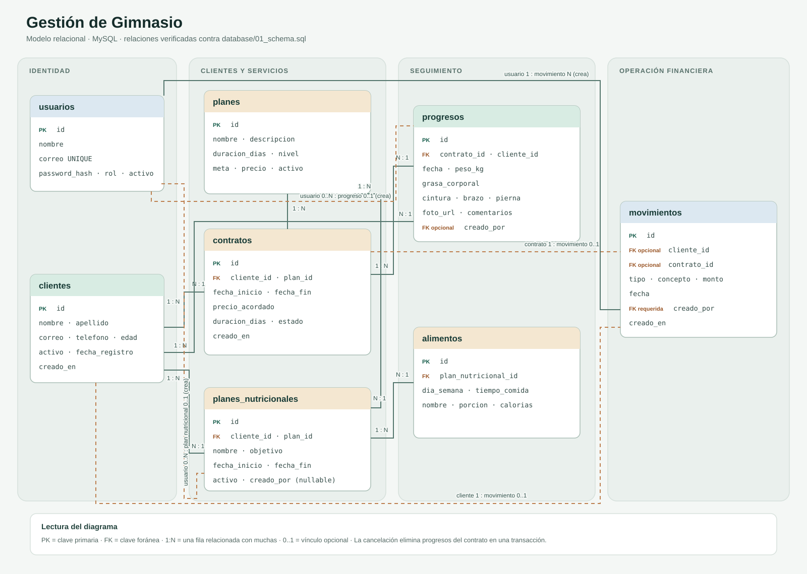

# Documentación integral del proyecto

## 1. Identificación

**Nombre:** Gestión de Gimnasio  
**Tipo:** aplicación de línea de comandos (CLI)  
**Runtime:** Node.js con módulos ES  
**Persistencia implementada:** MySQL mediante `mysql2/promise`  
**Propósito:** administrar clientes, planes de entrenamiento, contratos, seguimiento físico, alimentación y movimientos financieros desde una consola.

> **Desviación de requisito:** el enunciado académico exige MongoDB con el driver `mongodb`. Esta versión usa MySQL y no contiene MongoDB, Mongoose ni `dotenv`. Se requiere aprobación expresa del docente si se desea conservar MySQL; las dos bases no son intercambiables a efectos de evaluación.

## 2. Alcance funcional

### Acceso y roles

El usuario inicia sesión con correo y contraseña. `AuthService` consulta un usuario activo y verifica el hash con `bcryptjs`. La CLI distingue `ADMIN` y `ENTRENADOR`: el menú restringe determinadas opciones administrativas y financieras.

### Clientes

Se pueden registrar, listar, buscar, actualizar y desactivar clientes. La desactivación es lógica (`activo = FALSE`), por lo que conserva las referencias históricas en contratos y finanzas. Los campos principales y validaciones de dominio están en `src/domain/Cliente.js`.

### Planes y contratos

Los planes incluyen nombre, descripción, duración en días, nivel, meta, precio y estado activo. El usuario puede crear, listar, actualizar y desactivar planes.

Al asignar un plan a un cliente se crea automáticamente un contrato con fechas de inicio y fin, precio/duración acordados y estado. El precio y la duración quedan copiados en el contrato como fotografía histórica, aunque cambie posteriormente el catálogo. Los contratos se pueden listar, renovar, finalizar o cancelar.

- **Renovación:** en una transacción finaliza el contrato activo anterior y crea el siguiente, normalmente desde el día posterior al vencimiento.
- **Cancelación:** en una transacción bloquea el contrato, elimina sus registros de progreso y cambia su estado a `CANCELADO`. Si algo falla, se revierten ambas modificaciones.
- **Finalización:** cambia un contrato activo a `FINALIZADO`.

### Seguimiento físico

Se registra como máximo un progreso por semana y contrato. Se guardan fecha, peso, porcentaje de grasa opcional, medidas de cintura/brazo/pierna, comentarios, usuario que lo registró y una referencia `foto_url`. El historial se consulta cronológicamente y un registro se puede eliminar.

La foto es una ruta o URL: el proyecto no carga archivos ni guarda imágenes binarias. El seguimiento requiere un contrato activo y una asociación correcta entre cliente y contrato.

### Nutrición

Un plan nutricional queda asociado a cliente y plan de entrenamiento. Solo se crea si existe un contrato activo para esa combinación. El plan contiene nombre, objetivo y fechas. Se pueden agregar alimentos por día de semana y tiempo de comida, con porción y calorías opcionales. La consulta presenta alimentos ordenados y un resumen semanal con cantidades y calorías por día.

Todavía no se implementan la edición/desactivación de planes nutricionales ni alimentos, ni reglas dietéticas avanzadas.

### Finanzas

Se registran ingresos y egresos con concepto, monto, fecha y usuario. Se listan movimientos y se calcula balance global o filtrado por fecha inicial, fecha final y cliente. El balance se agrega en SQL para no cargar todos los movimientos en memoria de Node.js. Las fechas se validan estrictamente y se rechazan rangos invertidos. Un movimiento opcionalmente asociado a contrato valida que este exista y esté activo, y que pertenezca al cliente indicado.

No hay todavía una entidad de pago recurrente, facturación de mensualidades, cobro automatizado ni flujo de sesiones individuales asociado a un contrato.

## 3. Arquitectura


El flujo general es:

```text
CLI (Inquirer/Chalk)
        |
        v
Services (reglas de aplicación)
        |
        v
Repositories (SQL parametrizado)
        |
        v
MySQL (mysql2/promise)
```

`src/app.js` compone las dependencias, controla el login y presenta los menús. Los servicios coordinan validaciones y operaciones. Los repositorios concentran las consultas SQL. `src/domain/` aloja las entidades Cliente/Plan y la Factory de movimientos; `src/models/` aloja modelos validados de progreso y nutrición.

### Patrones

- **Repository:** encapsula el acceso a tablas y consultas, por ejemplo `ClienteRepository`, `ContratoRepository` y `FinanzasRepository`.
- **Factory:** `MovimientoFactory` valida y construye el objeto de movimiento antes de persistirlo.

### Principios SOLID observables

Se aplica responsabilidad única de forma básica al separar CLI, servicios y repositorios. Las dependencias se pasan a los constructores de servicios/repositorios. Esto no demuestra cumplimiento completo de todos los principios SOLID: hay composición y flujo de interacción concentrados en `app.js`, no se definen interfaces explícitas y quedan reglas por completar.

## 4. Estructura del repositorio

```text
.
|-- database/
|   |-- 01_schema.sql                     # Esquema para instalaciones nuevas
|   |-- 02_seed.sql                       # Usuarios y planes de demostración
|   `-- 03_seguimiento_nutricion.sql       # Migración para esquemas anteriores
|-- docs/
|   |-- 01_documentacion_general.md
|   |-- 02_requisitos.md                  # Matriz de cobertura
|   |-- 03_modelo_datos.md
|   |-- 04_arquitectura.md
|   |-- 05_scrum.md
|   |-- 06_pruebas.md
|   |-- 07_presentacion.md
|   |-- 08_diagrama_relacional.txt
|   `-- 09_documentacion_proyecto.md      # Este documento
|-- src/
|   |-- app.js                            # Entrada CLI y composición
|   |-- config/database.js                # Pool de conexión
|   |-- domain/                            # Cliente, Plan y Factory
|   |-- models/                            # Progreso y nutrición validados
|   |-- repositories/                      # Persistencia SQL
|   `-- services/                          # Casos de uso
|-- tests/unit/                            # Pruebas Node.js node:test
|-- .gitignore
|-- package.json
`-- package-lock.json
```

La plantilla del enunciado menciona también carpetas `/commands` y `/utils`; este proyecto no las usa. Los comandos CLI se encuentran actualmente en `src/app.js`.

## 5. Modelo de datos



| Tabla | Propósito y relaciones principales |
|---|---|
| `usuarios` | Cuentas activas, rol y hash bcrypt. |
| `clientes` | Datos del cliente y estado lógico. |
| `planes` | Catálogo de planes, duración, nivel, metas y precio. |
| `contratos` | Asignación cliente-plan, fechas, estado y precio/duración históricos. |
| `progresos` | Medidas por cliente y contrato, ordenadas por fecha. |
| `planes_nutricionales` | Plan de alimentación asociado a cliente y plan de entrenamiento. |
| `alimentos` | Alimentos por día/comida, porción y calorías. |
| `movimientos` | Ingresos/egresos, opcionalmente relacionados con cliente/contrato. |

Las claves foráneas y restricciones `CHECK` protegen integridad básica. Los detalles de normalización y el diagrama están en [03_modelo_datos.md](03_modelo_datos.md) y [08_diagrama_relacional.txt](08_diagrama_relacional.txt).

## 6. Transacciones y consistencia

Las operaciones críticas usan una conexión dedicada obtenida del pool:

1. `beginTransaction()` inicia la unidad de trabajo.
2. Se leen/bloquean filas relacionadas cuando hace falta.
3. Se ejecutan escrituras vinculadas.
4. `commit()` confirma todo o `rollback()` revierte todo ante error.
5. `release()` devuelve la conexión al pool en `finally`.

Operaciones protegidas: asignar contrato, renovar contrato, cancelar contrato junto con sus progresos, registrar progreso y crear plan nutricional bajo contrato activo, y registrar movimientos financieros. Las pruebas unitarias verifican secuencia de commit/rollback usando conexiones simuladas; todavía falta comprobarlas con un servidor MySQL real.

## 7. Seguridad y configuración

La conexión usa estas variables de entorno, sin cargar `.env`:

- `DB_HOST`
- `DB_PORT`
- `DB_USER`
- `DB_PASSWORD`
- `DB_NAME`

Los repositorios usan consultas parametrizadas. Las contraseñas no se comparan en texto plano: `bcryptjs` verifica el hash. El seed contiene credenciales públicas de demostración (`admin@gym.com` y `entrenador@gym.com`, clave `123456`); no deben reutilizarse en un entorno real.

El filtrado del menú por rol se complementa con comprobaciones en los servicios financieros y en las mutaciones de contratos. Conviene extender las mismas comprobaciones a toda operación administrativa antes de un despliegue real.

## 8. Instalación y comandos

Requisitos: Node.js 20+, npm y MySQL 8+.

1. Ejecutar `database/01_schema.sql` y luego `database/02_seed.sql` para una base nueva.
2. Para un esquema anterior, respaldar datos, revisar y aplicar `database/03_seguimiento_nutricion.sql`; se deben asociar registros históricos a contratos/planes válidos.
3. Ejecutar `npm install`.
4. Definir las variables `DB_*` en el entorno.
5. Ejecutar `npm start`.
6. Ejecutar `npm test` para la suite automatizada.

Los ejemplos de PowerShell y Linux/macOS están en [README.md](../README.md).

## 9. Pruebas

La suite usa `node:test`. La última ejecución registrada tiene **32 pruebas aprobadas y 0 fallidas**. Cubre validaciones de modelos y fechas, `MovimientoFactory`, rechazo de correos con espacios, autorización por rol, reglas semanales, agregación financiera SQL y rollback/commit simulado de operaciones críticas.

No equivale a pruebas de integración: aún se debe ejecutar el flujo completo contra MySQL y registrar configuración, fecha y resultados. Ver [06_pruebas.md](06_pruebas.md).

## 10. Limitaciones y pendientes de entrega

- La persistencia es MySQL aunque el enunciado exige MongoDB con el driver `mongodb`; solicitar aprobación o migrar antes de entregar.

- Faltan edición/desactivación de planes nutricionales y administración de alimentos.
- Faltan cobros automáticos y asociación completa de pagos con mensualidades/sesiones.
- Faltan pruebas de integración reales con MySQL.
- Scrum: el tablero GitHub Projects v2 está creado y público en [github.com/users/steff-360/projects/2](https://github.com/users/steff-360/projects/2), con las 25 historias de usuario vinculadas. La planeación completa está en `05_scrum.md`. Las ceremonias se registrarán conforme ocurran.
- No se ha adjuntado el PDF Scrum según plantilla ni publicado/enlazado el video de máximo 7 minutos.
- La privacidad del repositorio y la invitación al trainer deben verificarse en GitHub.

Esta guía describe el estado del código y no reemplaza esos entregables externos. El estado detallado por requisito está en [02_requisitos.md](02_requisitos.md).
